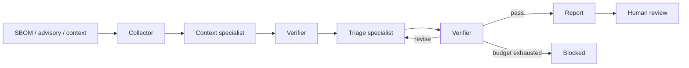

# BioSBOM-AgentKG

**바이오인포매틱스 소프트웨어 공급망을 위한 근거 검증형 멀티에이전트 시스템**

> Evidence-checked multi-agent triage for bioinformatics software supply chains.

SBOM 구성요소와 공개 취약점, 실행 환경의 데이터 민감도·노출도·중요도를 연결해 조치 우선순위를 제안하는 연구 프로토타입이다. 에이전트의 판단은 독립 검증을 통과해야 보고서에 반영되며, 오류는 제한된 횟수 안에서 재검토한다. 최종 결과는 사람 검토 상태로 남긴다.

이 공개 준비본은 기존 BioSBOM-AgentKG의 정규화·스키마 코드를 바탕으로 실행 구조를 추가한 0.2 개발본이다. 핵심은 DNA 분석 자체가 아니라 **바이오 분석에 사용하는 소프트웨어의 보안 평가**다.

## 1. 구현한 기능

| 영역 | 구현 |
|---|---|
| 입력 | CycloneDX / SPDX JSON, OSV 형식 advisory snapshot, 자산 맥락, 선택적 CVSS·EPSS·KEV sidecar |
| 근거 연결 | PURL 우선 matching, 명시된 affected version 확인, snapshot SHA-256 |
| 에이전트 | 수집, 맥락 분석, 위험도 판단, 독립 검증, 보고서 생성, 사람 검토 |
| 실행 제어 | 구조화된 메시지, 단계별 재검토, 호출·completion-token 예산, timeout, 실패 기록 |
| LLM 연결 | 선택적 OpenAI-compatible endpoint; 역할별 model 설정 |
| 비교 조건 | 규칙 기반, 단일 에이전트, 단일 에이전트+재검토, 멀티에이전트+재검토 |
| 산출물 | HTML/Markdown 보고서, JSON 그래프·근거·판정, 이벤트 로그, package disposition CSV |
| 사람 검토 | 파일 무결성·판정 재검증 후 승인·보류·거절 기록 |



기본 모드에서는 역할별 규칙 기반 실행으로 동작한다. `--mode llm`에서는 맥락 분석과 위험도 판단을 실제 모델에 위임한다. 수집·검증·보고서 렌더링은 결정론적 코드가 담당한다. 모델이 없거나 실패했을 때 규칙 기반 성공으로 몰래 대체하지 않는다.

## 2. 실행 방법

Python 3.11 이상이 필요하다. 저장소 루트에서:

```bash
python -m venv .venv
```

Windows PowerShell: `.\.venv\Scripts\Activate.ps1` / macOS·Linux: `source .venv/bin/activate`

```bash
python -m pip install -e ".[dev]"
biosbom-agentkg run --case examples/rnaseq-case.json --output runs/demo
biosbom-agentkg verify runs/demo
python -m pytest -q
```

`runs/demo/report.html`을 브라우저로 열면 근거와 에이전트 처리 과정을 확인할 수 있다. 예제는 **합성 취약점과 합성 자산**이며 실제 제품의 취약성을 주장하지 않는다. 기존 출력 폴더를 덮어쓰지 않으므로 재실행할 때 새 경로를 사용한다.

사람 검토 기록:

```bash
biosbom-agentkg review runs/demo --decision hold --reviewer demo-reviewer --reason "Review evidence before approval"
```

`approve`, `hold`, `reject`를 지원한다. 차단된 실행은 승인할 수 없으며, 이미 기록한 결정은 덮어쓰지 않는다. 이 명령은 실제 패치나 배포를 수행하지 않는다.

## 3. 실제 모델 연결

`.env.example`은 설정 이름 안내용이며 자동으로 로드하지 않는다. PowerShell 예시:

```powershell
$env:BIOSBOM_BASE_URL = "http://localhost:11434/v1"
$env:BIOSBOM_MODEL = "your-installed-model"
biosbom-agentkg run --case examples/rnaseq-case.json --output runs/llm-demo --mode llm --max-calls 8 --max-revisions 2
```

외부 endpoint는 HTTPS를 사용한다. 필요한 키는 `BIOSBOM_API_KEY`에 설정한다. `BIOSBOM_CONTEXT_MODEL`, `BIOSBOM_TRIAGE_MODEL`, `BIOSBOM_SINGLE_MODEL`로 역할별 모델을 지정할 수 있다. Provider 호환성과 실제 모델 품질은 별도 검증 사항이다.

## 4. 실험 결과와 재현


[HTML 데모 보고서](docs/experiments/demo-report.html)도 저장되어 있다. GitHub에서는 파일을 내려받아 브라우저로 열 수 있다.

- [조건별 실험 결과표와 원자료](docs/experiments/fault-injection/RESULTS.md): 오류 주입 **570회**, 57개 조건, 조건당 10 seeds.
- [공개 OSV snapshot 사례](docs/experiments/PUBLIC_SNAPSHOT.md): 실제 공개 advisory 2건을 사용한 matching·불확실성 처리 검사.
- [검증 기록](VALIDATION.md): 테스트, 실제 실행 범위와 미검증 항목.
- [진행 상태와 보완 과제](docs/STATUS.md).

```bash
biosbom-agentkg evaluate --case examples/rnaseq-case.json --output runs/fault-evaluation --seeds 10
biosbom-agentkg run --case examples/public-snapshot-case.json --output runs/public-snapshot
```

오류 주입 비교는 **scripted provider를 사용한 제어 흐름 실험**이다. 실제 LLM의 정확도나 비용을 측정한 결과가 아니다. 재검토가 가능한 단일 에이전트 비교군도 포함해, 복구 효과를 단순히 에이전트 수의 효과로 해석하지 않도록 했다.

## 5. 해석할 때 주의할 점

- `affected`는 입력 advisory에 버전이 명시되어 있다는 의미이며, 실제 공격 가능성의 확정이 아니다.
- 미일치 package는 안전 판정이 아니다. 검사한 snapshot 밖의 취약점이 있을 수 있다.
- 버전 누락과 현재 지원하지 않는 range는 검토 대상으로 남긴다. 최신 버전이라고 임의로 `fixed` 처리하지 않는다.
- 위험도 기준은 설명 가능한 정책 규칙이다. 실제 사고 확률로 보정된 모델은 아니다.
- 호출 예산은 completion-token 요청량을 제한한다. 입력 token·실제 요금의 상한을 보장하지 않는다.
- 검토자의 이름과 파일 hash는 인증 체계나 전자서명을 대신하지 않는다.

## 6. 코드 구조와 공개 범위

| 위치 | 내용 |
|---|---|
| [multiagent/](src/biosbom_agentkg/multiagent/) | 근거 수집, 역할별 계약, verifier, orchestration, provider, 저장·보고서·실험 |
| [sbom.py](src/biosbom_agentkg/sbom.py) | 기존 CycloneDX/SPDX 정규화 |
| [schemas.py](src/biosbom_agentkg/schemas.py) | 기존 구성요소·취약점·자산 모델 |
| [tests/](tests/) | 오류 복구, 근거 조작, 입력 검증, HTTP 계약, CLI, 사람 승인 테스트 |
| [examples/](examples/) | 작은 합성 사례와 공개 advisory의 사실 정보 |
| [설계 문서](docs/ARCHITECTURE.md) | 정책 기준, 메시지와 상태 전이, 저장·실행 한계 |

내부 SBOM·자산 목록·운영망 주소·환자 데이터·API 키·기존 작업 이력은 포함하지 않는다. [SECURITY.md](SECURITY.md)에 입력 전송과 산출물 관리 범위를 설명했다. 현재 별도 오픈소스 재사용 라이선스는 부여하지 않았다. 외부 데이터·모델은 원 출처의 이용 조건을 따른다.
