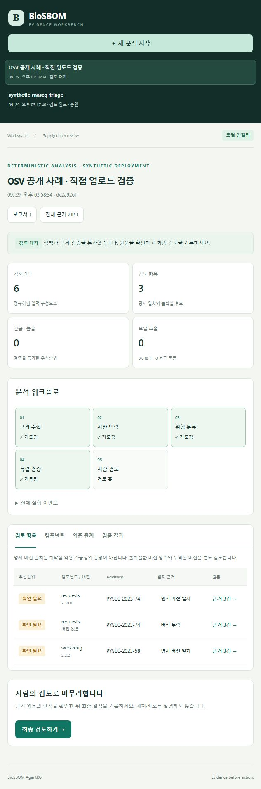
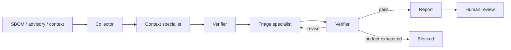
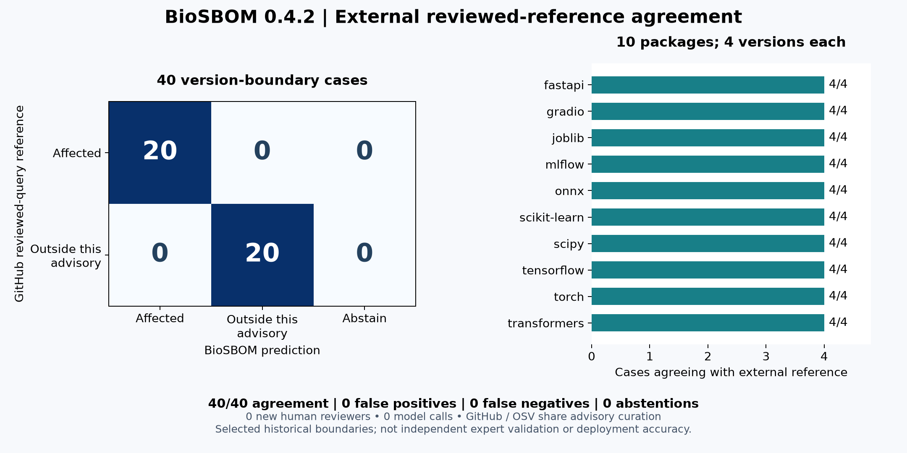

# BioSBOM-AgentKG

**바이오인포매틱스 소프트웨어 공급망을 위한 근거 검증형 멀티에이전트 시스템**

> Evidence-checked multi-agent triage for bioinformatics software supply chains.

SBOM 구성요소와 공개 취약점, 실행 환경의 데이터 민감도·노출도·중요도를 연결해 조치 우선순위를 제안하는 연구 프로토타입이다. 에이전트의 판단은 독립 검증을 통과해야 보고서에 반영되며, 오류는 제한된 횟수 안에서 재검토한다. 최종 결과는 사람 검토 상태로 남긴다.

이 공개 준비본은 기존 BioSBOM-AgentKG의 정규화·스키마 코드를 바탕으로 브라우저 작업 공간과 지속 실행 관리를 추가한 0.4.2 공개본이다. 핵심은 DNA 분석 자체가 아니라 **바이오 분석에 사용하는 소프트웨어의 보안 평가**다.



**외부 검토 자료 평가:** 개발 패널과 겹치지 않는 10개 패키지·40개 버전 사례에서 GitHub reviewed advisory 기준과 40/40 일치했다. 오탐·미탐·보류는 각각 0개다. 신규 인간 평가자는 0명이며 GitHub/OSV의 원천 정보가 공유되므로 독립 전문가 정확도로 해석하지 않는다. [그림·원자료·재현 방법·전문가 평가 준비](docs/EXTERNAL_REVIEW_EVALUATION.md).

**0.4.2 업데이트:** CVSS 누락·불확실 버전을 별도 검토 상태로 명시했다. 새 48회 비교에서 수정 후 단일·멀티 각각 12/12가 재검토 없이 통과했다. 기록 전환과 근거 조회의 응답 순서, 검토 대상 고정, 한국어 실패 안내도 보완했다. [실험과 비용·시간의 한계](docs/TRIAGE_ABLATION.md).

**0.4.1 업데이트:** 빈 위험 맥락에도 원본 근거를 인용하도록 모델 계약을 명시했다. 새 32회 비교에서 근거 참조 오류 이벤트가 9→0, 호출이 34→25로 감소했다. 검증 기준을 완화하지 않았으며 개발 패널 밖의 효과는 아직 미검증이다. [수정 전후 원자료·한계](docs/CITATION_ABLATION.md).

**0.4 업데이트:** PyPI·SemVer 버전 범위 판정, SBOM + OSV 파일 직접 업로드, 저장·모델 호출 없는 입력 미리보기, 과거 분석·검토 해시 호환성. 기존 로컬 웹앱·실행 큐·복구·사람 검토·ZIP 내보내기를 유지한다. [웹앱 사용 안내](docs/WORKBENCH.md)와 [검증 범위](docs/STATUS.md)를 함께 확인할 수 있다.

## 1. 구현한 기능

| 영역 | 구현 |
|---|---|
| 웹 작업 공간 | 반응형 한국어 UI, 예제·Case JSON·SBOM + OSV 업로드·입력 미리보기, 실행 이력, 근거·의존 관계·검증 탭 |
| 지속 실행 | SQLite FIFO 큐, 요청 멱등성, 단일 worker 소유권, 중단 표시와 명시적 재시도 |
| 입력 | CycloneDX / SPDX JSON, OSV 형식 advisory snapshot, 자산 맥락, 선택적 CVSS·EPSS·KEV sidecar |
| 근거 연결 | PURL 우선 matching, 명시 버전 및 PyPI·SemVer 범위 확인, snapshot SHA-256 |
| 에이전트 | 수집, 맥락 분석, 위험도 판단, 독립 검증, 보고서 생성, 사람 검토 |
| 실행 제어 | 구조화된 메시지, 단계별 재검토, 호출·completion-token 예산, timeout, 실패 기록 |
| LLM 연결 | 선택적 OpenAI-compatible endpoint; 역할별 model 설정 |
| 비교 조건 | 규칙 기반, 단일 에이전트, 단일 에이전트+재검토, 멀티에이전트+재검토 |
| 산출물 | HTML/Markdown 보고서, JSON 그래프·근거·판정, 이벤트 로그, package disposition CSV |
| 사람 검토 | 파일 무결성·판정 재검증 후 승인·보류·거절 기록 |



기본 모드에서는 역할별 규칙 기반 실행으로 동작한다. `--mode llm`에서는 맥락 분석과 위험도 판단을 실제 모델에 위임한다. 수집·검증·보고서 렌더링은 결정론적 코드가 담당한다. 모델이 없거나 실패했을 때 규칙 기반 성공으로 몰래 대체하지 않는다.

## 2. 실행 방법

Python 3.11 이상이 필요하다. 저장소 루트에서:

```bash
python -m venv .venv
```

Windows PowerShell: `.\.venv\Scripts\Activate.ps1` / macOS·Linux: `source .venv/bin/activate`

```bash
python -m pip install -e ".[web,dev]"
biosbom-agentkg serve --port 8876
biosbom-agentkg run --case examples/rnaseq-case.json --output runs/demo
biosbom-agentkg verify runs/demo
python -m pytest -q
```

**웹앱:** 서버 실행 후 브라우저에서 `http://127.0.0.1:8876`을 연다. 서버 종료는 Ctrl+C. 기본 데이터 폴더는 `runs/workbench/`이며 다른 서버와 같은 폴더를 공유할 수 없다. 위 CLI 분석 명령은 별도 터미널에서 실행한다.

`runs/demo/report.html`을 브라우저로 열면 근거와 에이전트 처리 과정을 확인할 수 있다. 예제는 **합성 취약점과 합성 자산**이며 실제 제품의 취약성을 주장하지 않는다. 기존 출력 폴더를 덮어쓰지 않으므로 재실행할 때 새 경로를 사용한다.

사람 검토 기록:

```bash
biosbom-agentkg review runs/demo --decision hold --reviewer demo-reviewer --reason "Review evidence before approval"
```

`approve`, `hold`, `reject`를 지원한다. 차단된 실행은 승인할 수 없으며, 이미 기록한 결정은 덮어쓰지 않는다. 이 명령은 실제 패치나 배포를 수행하지 않는다.

## 3. 실제 모델 연결

`.env.example`은 설정 이름 안내용이며 자동으로 로드하지 않는다. PowerShell 예시:

```powershell
$env:BIOSBOM_BASE_URL = "http://localhost:11434/v1"
$env:BIOSBOM_MODEL = "your-installed-model"
biosbom-agentkg run --case examples/rnaseq-case.json --output runs/llm-demo --mode llm --max-calls 8 --max-revisions 2
```

외부 endpoint는 HTTPS를 사용한다. 필요한 키는 `BIOSBOM_API_KEY`에 설정한다. `BIOSBOM_CONTEXT_MODEL`, `BIOSBOM_TRIAGE_MODEL`, `BIOSBOM_SINGLE_MODEL`로 역할별 모델을 지정할 수 있다. `BIOSBOM_API_STYLE=responses`는 OpenAI Responses 형식을 선택한다. `chat`이 기본값이며 Ollama 호환 방식이다. Responses 모드에서는 `store: false`와 strict JSON Schema를 사용한다. 실제 모델 평가는 [검증 문서](docs/RESEARCH_EVALUATION.md)에 기록한다.

## 4. 실험 결과와 재현

최신 검증은 [외부 검토 자료와의 40개 버전 판정 비교](docs/EXTERNAL_REVIEW_EVALUATION.md)다. 실제 모델 실험인 [0.4.2 판정 계약 비교](docs/TRIAGE_ABLATION.md)와 이전 [0.4.1 인용 계약 비교](docs/CITATION_ABLATION.md)는 별도 보존한다. 아래의 공개 corpus와 24회 모델 패널은 별도 0.4 기준 결과이며 합산하지 않는다.




| 측정 | 기록 |
|---|---|
| 자동 테스트 | Python 146개·UI 상태 5개 통과: 버전 경계·과거 산출물 호환성·미리보기·웹 API·실행 관리·연구 예산 경계 |
| 공개 OSV corpus | 8개 advisory × 9개 통제 변형 = 72개, 예상 처리와 72개 일치 |
| 크기별 반복 측정 | 10 / 100 / 1,000 컴포넌트 × 30회 = 90회 |
| 핵심 분석 중앙값 | 각각 0.688 / 2.030 / 15.197 ms (한 Windows 환경) |
| 1,000 컴포넌트 p95 | 19.784 ms; HTTP·저장·LLM 제외 |
| 실제 LLM 비교 | gpt-5.6-luna 24회: 단일+재검토 12/12, 멀티+재검토 11/12 최종 검증 통과 |

[0.4 실험 방법·한계·재현 명령](docs/RESEARCH_EVALUATION.md)에 원자료와 연결된 해석을 기록했다. **72/72는 출처에서 만든 fixture 계약 일치이며 일반화 정확도가 아니다.** 같은 수정 경계 8건에서 불확실 후보가 8개 → 0개로 줄었다. 미지원·잘못된 버전은 보류한다. [버전 판정 범위와 이전 기록 호환성](docs/VERSION_MATCHING.md)을 함께 공개했다.


실제 비교에서는 총 48호출·72,052 보고 tokens를 사용했다. 멀티 구성의 우수성은 관찰되지 않았으며, 실패 1건은 검증 단계에서 차단됐다. 규칙 기반 비교군은 같은 6개 사례를 호출 없이 통과했다. 작은 개발 패널의 계약 검증 결과이며 독립 정확도 평가가 아니다. [원자료와 실패 분석](docs/RESEARCH_EVALUATION.md)을 함께 공개한다.

[HTML 데모 보고서](docs/experiments/demo-report.html)도 저장되어 있다. GitHub에서는 파일을 내려받아 브라우저로 열 수 있다.

- [조건별 실험 결과표와 원자료](docs/experiments/fault-injection/RESULTS.md): 오류 주입 **570회**, 57개 조건, 조건당 10 seeds.
- [공개 OSV snapshot 사례](docs/experiments/PUBLIC_SNAPSHOT.md): 실제 공개 advisory 2건을 사용한 matching·불확실성 처리 검사.
- [검증 기록](VALIDATION.md): 테스트, 실제 실행 범위와 미검증 항목.
- [진행 상태와 보완 과제](docs/STATUS.md).

```bash
biosbom-agentkg evaluate --case examples/rnaseq-case.json --output runs/fault-evaluation --seeds 10
biosbom-agentkg run --case examples/public-snapshot-case.json --output runs/public-snapshot
```

오류 주입 비교는 **scripted provider를 사용한 제어 흐름 실험**이다. 실제 LLM의 정확도나 비용을 측정한 결과가 아니다. 재검토가 가능한 단일 에이전트 비교군도 포함해, 복구 효과를 단순히 에이전트 수의 효과로 해석하지 않도록 했다.

## 5. 해석할 때 주의할 점

- `affected`는 입력 advisory의 명시 버전 또는 지원 범위에 일치한다는 의미이며, 실제 공격 가능성의 확정이 아니다.
- 미일치 package는 안전 판정이 아니다. 검사한 snapshot 밖의 취약점이 있을 수 있다.
- 버전 누락과 현재 지원하지 않는 range는 검토 대상으로 남긴다. 최신 버전이라고 임의로 `fixed` 처리하지 않는다.
- 위험도 기준은 설명 가능한 정책 규칙이다. 실제 사고 확률로 보정된 모델은 아니다.
- 호출 예산은 completion-token 요청량을 제한한다. 입력 token·실제 요금의 상한을 보장하지 않는다.
- 검토자의 이름과 파일 hash는 인증 체계나 전자서명을 대신하지 않는다.

## 6. 코드 구조와 공개 범위

| 위치 | 내용 |
|---|---|
| [multiagent/](src/biosbom_agentkg/multiagent/) | 근거 수집, 역할별 계약, verifier, orchestration, provider, 저장·보고서·실험 |
| [sbom.py](src/biosbom_agentkg/sbom.py) | 기존 CycloneDX/SPDX 정규화 |
| [schemas.py](src/biosbom_agentkg/schemas.py) | 기존 구성요소·취약점·자산 모델 |
| [web/](src/biosbom_agentkg/web/) | 로컬 브라우저 경계, HTTP API, 지속 큐, 정적 UI |
| [benchmarks/](benchmarks/) | 공개 고정 corpus, 반복 시간 측정, opt-in 실제 모델 비교 |
| [tests/](tests/) | 오류 복구, 근거 조작, 입력 검증, HTTP 계약, CLI, 사람 승인 테스트 |
| [examples/](examples/) | 작은 합성 사례와 공개 advisory의 사실 정보 |
| [설계 문서](docs/ARCHITECTURE.md) | 정책 기준, 메시지와 상태 전이, 저장·실행 한계 |

내부 SBOM·자산 목록·운영망 주소·환자 데이터·API 키·기존 작업 이력은 포함하지 않는다. [SECURITY.md](SECURITY.md)에 입력 전송과 산출물 관리 범위를 설명했다. 현재 별도 오픈소스 재사용 라이선스는 부여하지 않았다. 외부 데이터·모델은 원 출처의 이용 조건을 따른다.
