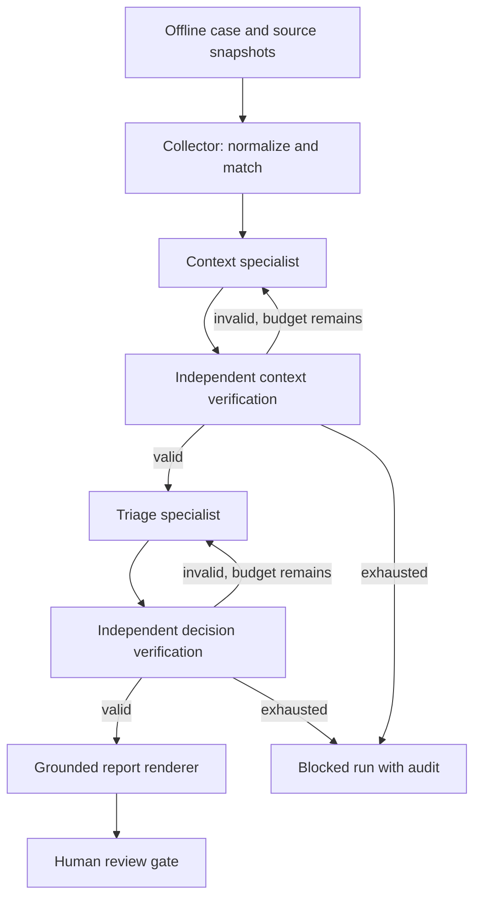

# Architecture and contracts

The 0.2 runtime builds on the original SBOM normalizer and typed component schema. It is a curated development edition; manuscript administration and legacy reporting pipelines are not included. `CORE_ORIGIN.json` records the original source-file hashes, before formatting.

## Roles

| Role | Receives | Produces | Authority |
|---|---|---|---|
| Collector | CycloneDX/SPDX, OSV snapshots, context, intelligence | All package dispositions, findings, content-addressed evidence | Deterministic parsing and matching |
| Context specialist | Numeric asset attributes and source references | Enumerated concerns and citations | Rule mode or model-backed analysis |
| Triage specialist | Validated context, findings, policy constraints | Status, priority and citations per finding | May escalate, cannot downgrade or invent findings |
| Verifier | Source-derived collection and specialist proposals | Structured issues or pass | Deterministic; never waived by a model |
| Reporter | Verified decisions and audit | Markdown, HTML, graph and evidence index | Template rendering, no unsupported free-text claims |
| Human gate | Immutable run artifacts | Approve / hold / reject record | No software remediation is executed |

`run_case()` is the orchestration API. Agents exchange Pydantic-validated records. A failed context stage cannot feed the triage stage. A failed triage stage cannot publish verified decisions. Events bind each input and output using SHA-256; raw provider messages and transport error bodies are not recorded.

## Matching and uncertainty

- Prefer package URLs, retaining qualifiers so distro/architecture identities are not merged.
- Fall back to a known ecosystem and exact package name when a comparable PURL is unavailable.
- An explicitly affected installed version creates an `exact_version` finding.
- Missing versions remain `version_missing`. Unsupported ranges remain `ambiguous`.
- No fuzzy name matching, generic numeric version comparison, or inference that a package is safe from absence in a snapshot.
- Advisory aliases remain aliases; the runtime does not invent a CVE mapping.
- Withdrawn records are excluded with a recorded warning.
- Malformed, nested or duplicate identities fail explicitly instead of silently losing components.

The first release deliberately leaves ecosystem/Git range resolution for subsequent work. For example, a version at a documented fixed boundary can remain `ambiguous` if the only remaining evidence requires interpreting an unsupported range. That conservative false-positive burden is visible in the public snapshot experiment.

## Policy

Context concerns use sensitivity/exposure/criticality thresholds of 7, and weak controls at or below 3. An exact match with KEV=true, or CVSS>=9 and exposure>=7, requires urgent priority. CVSS>=7, EPSS>=0.5, or a sensitive and critical asset requires high priority. Other known-severity exact matches have a normal floor. Uncertain matches or missing CVSS require manual review. These are inspectable **heuristic policy rules**, not a learned or calibrated risk model.

The original weighted `risk.py` remains available for comparison; the new runtime uses the conservative policy above and does not confuse the two scoring schemes.

## Runtime boundaries

`max_revisions` is per specialist stage. Every attempted call consumes one reservation, including failed HTTP calls. `max_calls` and `max_completion_tokens` are checked before dispatch. The completion budget limits requested completion tokens; it does not cap prompt tokens or total monetary cost. Backend token usage is recorded when available, otherwise explicitly incomplete.

Transport supports an OpenAI-compatible `/chat/completions` endpoint with JSON-object responses. Separate context, triage and single-agent model names can be configured. [Ollama's documented compatibility interface](https://docs.ollama.com/api/openai-compatibility) is a supported target interface; the checked-in test results use a local HTTP fixture, not a real Ollama model.

## Storage and review

The writer reserves a new run directory exclusively and writes the manifest last. A partial publication without a complete manifest cannot be reviewed. Existing runs and human decisions cannot be overwritten through the API. The `verify` command checks file hashes, rebuilds the source-derived collection, and reruns the independent verifier before approval.

Hashes detect changed files relative to the manifest; this is **not** a digital signature or protection against an actor able to rewrite the entire run. Human reviewer names are local audit labels, not authenticated identities. Use an authenticated service, access controls and signed evidence if deploying this beyond a local research prototype.
