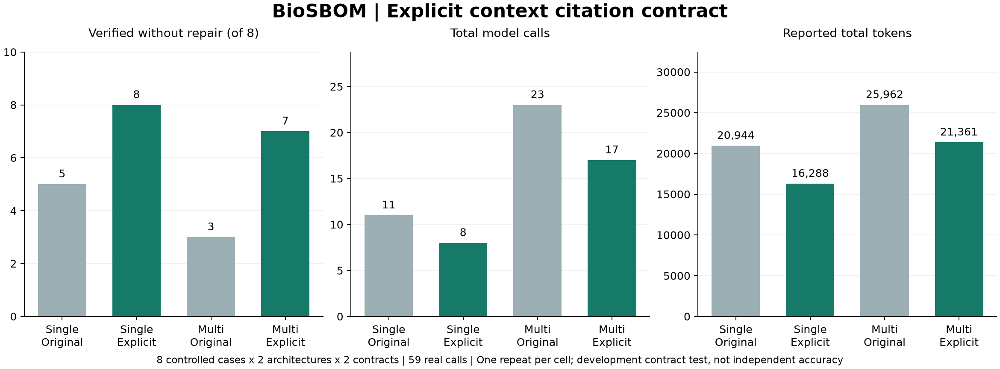

# Context citation ablation — protocol

The 0.4 development panel exposed missing context citations when concerns were empty. An empty concern list still requires the input snapshot as evidence. Version 0.4.1 makes that contract explicit in the model payload; the schema, policy thresholds and independent verifier are unchanged. No output is silently repaired by inserting citations.

## Fixed design

- Eight synthetic deployment cases in [the panel](../benchmarks/citation-panel-v041.json), fixed before calls: range-only, missing version, GIT-only, empty advisory lists and mixed public/synthetic findings; context thresholds cover empty, boundary and nonempty concerns.
- Two architectures × two citation contracts × eight cases × one repeat = **32 runs**. Shuffle seed 1741 interleaves all conditions. Every role requests the same configured model.
- `v04_original` removes only the new `context_citations` field. Initial payload hashes are tested against payloads generated from published commit `466806925ff004e4a9b2d5bb87ebdf7a1d27424d`. `explicit_citations` uses the current payload.
- Same schema, verifier, transport and budgets: six calls/run, two revisions/stage, 2,000 output tokens/call, 12,000 output-token reservation/run. Worst-case authorization: 192 calls; not a monetary cap.
- Primary measurement: verified completion without repair, reported separately by architecture and contract. Secondary measurements: final acceptance, context-evidence verifier events, total calls, reported tokens and elapsed time. A first-stage pass compares different stage content across architectures and is not a common accuracy metric.
- Retain every failure and intermediate attempt. No extra repeats selected after observing results. Calls may incur charges; no live calls in CI.

## Interpretation limits

This is a targeted development ablation informed by an observed failure, not independent held-out evaluation or a preregistered scientific study. Contexts are controlled mutations, not measured biological deployments. One repeat per cell and a requested model alias cannot establish statistical significance or generalize to other models. The deterministic verifier defines contract acceptance, not exploitability or scientific correctness.

The engine's event input hashes identify its payload before the ablation adapter. `calls.json` records the digest of the **actual transmitted** payload, role, schema and call settings, and attributes each call to its run and contract. No provider URL, key or header is published.

```bash
# Configure BIOSBOM_MODEL, BIOSBOM_BASE_URL, BIOSBOM_API_KEY locally.
# The recorded model experiment uses BIOSBOM_API_STYLE=responses.
python benchmarks/run_citation_ablation.py --cases benchmarks/citation-panel-v041.json --output runs/citation-ablation --max-total-calls 192 --confirm-live
```

## 실제 측정 결과 — 2026-09-29



같은 `gpt-5.6-luna` 요청 별칭과 Responses 전송으로 32회를 완료했다. 총 59호출·84,555 보고 tokens이며 모든 호출의 사용량이 알려져 있다. 각 조건의 최종 검증 통과는 모두 8/8이었다. 개선은 최종 통과율보다 **재검토 필요와 자원 사용 감소**에서 관찰되었다.

| 구성 | 인용 계약 | 재검토 없이 통과 | 최종 통과 | context_evidence 이벤트 | 호출 | 보고 tokens | 중앙 시간 |
|---|---|---:|---:|---:|---:|---:|---:|
| 단일 | 0.4 원래 계약 | 5/8 | 8/8 | 3 | 11 | 20,944 | 4.141초 |
| 단일 | 명시적 인용 계약 | 8/8 | 8/8 | 0 | 8 | 16,288 | 3.471초 |
| 멀티 | 0.4 원래 계약 | 3/8 | 8/8 | 6 | 23 | 25,962 | 8.477초 |
| 멀티 | 명시적 인용 계약 | 7/8 | 8/8 | 0 | 17 | 21,361 | 5.216초 |

두 구성을 합친 호출은 수정 전 34회에서 수정 후 25회로 줄었다. 맥락 근거 참조 오류는 9개 verifier 이벤트에서 0개로 줄었다. 이벤트 수는 서로 독립된 실패 사례 수가 아니다. 작은 단일 반복의 개발 패널 결과이므로 오류가 완전히 제거됐다고 일반화하지 않는다.

수정 후에도 `citation-range-threshold-concerns` 멀티 실행은 `review_required` 오류 때문에 한 차례 재검토했다. 버전 범위에 일치하더라도 CVSS가 없는 경우 정책상 우선순위는 `review`여야 하는데, 첫 응답이 이를 지키지 않았다. 독립 검증기가 차단하고 후속 응답이 통과했다. 이 오류를 고치기 위해 같은 패널을 반복 조정하지 않았다.

규칙 기반 비교군은 같은 8개 사례를 모델 호출 없이 모두 통과했다. 이 실험은 멀티에이전트의 우위나 LLM 필요성을 입증하지 않는다. 기존 0.4의 24회 실험과 표본·맥락이 다르므로 통과율을 합산하거나 두 패널을 직접 전후 비교하지 않는다.

### 보존 자료

- [프로토콜·실행 순서](experiments/citation-v041/protocol.json), [32회 결과 CSV](experiments/citation-v041/results.csv)
- [조건별 집계](experiments/citation-v041/summary.json), [사례별 paired 결과](experiments/citation-v041/paired-results.json)
- [59회 모델 응답·사용량](experiments/citation-v041/calls.json), [전체 판정·이벤트](experiments/citation-v041/run-records.json)
- [규칙 기반 비교군](experiments/citation-v041/deterministic-baseline.json), [실험 코드 해시](experiments/citation-v041/code-hashes.json)
- [실험 전 로컬 고정 커밋](https://github.com/CHOMINWOO1/BioSBOM-AgentKG/tree/40a1b5d4ba0d9878f68b6b3607a48564f671c364). 공개 사전등록이 아니며 코드 해시는 CRLF→LF 정규화 SHA-256이다.

32개 원래 실행 폴더의 manifest를 검증한 뒤 공개·합성 입력의 구조화 결과만 추출했다. 집계 스크립트는 실행별 trace 수, 토큰 합계, 최종 audit 일치와 조건 pairing을 확인한다.

```bash
python docs/experiments/summarize_citation_v041.py
python docs/experiments/render_citation_v041.py
```

기존 [0.4 결과](RESEARCH_EVALUATION.md)는 수정하지 않고 별도 보존했다.
