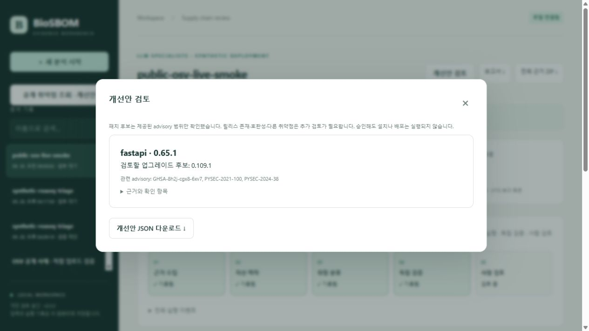
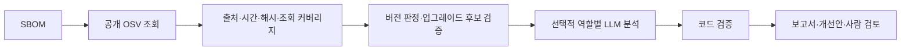
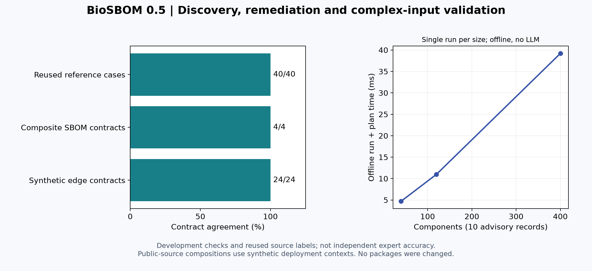

# 0.5 공개 자료 조회·개선안 생성·복합 SBOM 검증

2026-09-30. SBOM에서 공개 취약점 정보를 조회하고, 근거가 있는 업그레이드 후보를 만든 뒤 기존 LLM 분석·검증·사람 검토 흐름으로 연결한다. 실제 설치·패치·배포는 실행하지 않는다.



## 사용 흐름

1. 웹앱의 **공개 취약점 조회 · 개선안**에서 SBOM 또는 Case JSON을 선택한다.
2. 공개 패키지 이름·버전의 OSV 전송을 확인하고 조회한다. 내부 패키지는 먼저 제거한다.
3. 전체/일부 조회 상태, 미조회 사유, 개선안을 확인하고 조회 원자료를 저장한다.
4. 조회가 완료되고 입력 크기 제한 안에 있으면 **이 자료로 분석 구성**으로 규칙 기반 또는 LLM 분석을 실행한다.
5. 분석 결과의 **개선안 검토**에서 후보와 근거를 확인한다. 최종 분석 검토는 기존 사람 검토 기능으로 기록한다. 개선안은 실행 승인이 아니며 별도 변경 관리와 호환성 검증이 필요하다.

SBOM만 올리면 자산 맥락은 5/10 기본값이다. 이는 측정치가 아니므로 실제 평가에는 맥락을 작성한 Case JSON을 사용한다. 브라우저 조회 원자료는 자동 영구 저장하지 않으므로 다운로드 버튼으로 보관한다. 분석을 실행하면 해당 Case와 advisory 스냅샷은 기존 분석 기록에 저장된다.



## 조회 및 개선안의 범위

- 조회: PyPI·npm 공개 패키지 최대 50개. OSV 공식 HTTPS 주소만 사용하며 자산 맥락·인증정보는 보내지 않는다. 사용자가 지정한 주소나 advisory 안의 링크를 따라가지 않으며 redirect도 거절한다.
- 페이지네이션 처리, 같은 패키지·버전의 중복 조회 제거, 조회 예산 60회, 전체 시간 예산 45초와 요청별 timeout, 응답 4 MB·스냅샷 합계 8 MB 제한을 둔다. 시간 예산은 요청 사이에서 확인한다.
- 누락 버전·미지원 identity·네트워크 오류·페이지 순환·상충하는 스냅샷은 일부 조회로 남긴다. 빈 조회를 일반적인 안전 판정으로 바꾸지 않는다. 일부 조회에서는 업그레이드 후보를 보류하고 자동 분석 연결 버튼을 제공하지 않는다.
- 개선안은 `fixed` 경계 중 현재보다 높은 안정 버전을 모아, 제공된 동일 패키지의 모든 유효 advisory 범위에서 벗어나는지 재확인한다. 재도입 구간·알 수 없는 범위·로컬 빌드 등은 보수적으로 처리한다.
- 후보의 실제 릴리스 존재, 의존성 해결, lockfile 변경, API 호환성, 과학적 결과 재현성 및 미래 취약점은 보장하지 않는다. 같은 취약점의 GHSA/PYSEC 별칭 기록은 별도 근거로 유지하므로 advisory 개수를 고유 취약점 개수로 해석하지 않는다.
- 기존 LLM은 맥락·우선순위 분석을 맡고, 공개 조회와 패치 후보 검사는 코드가 수행한다. 원격 설명문을 실행하거나 LLM에 명령으로 전달하지 않는다.
- PyPI 표준에 맞춰 대소문자와 `.`, `_`, `-` 차이를 정규화한다. 새 결과 형식은 2.2이며 기존 2.0·2.1 기록은 당시 매칭 방식으로 검증한다. 과거 기록에 새 개선안을 요청하면 현재 규칙으로 계산한 제안이 표시되며, 과거 검토 결정이 그 제안을 승인한 것으로 간주되지 않는다.

## CLI

입력은 기존 Case 형식이며 공개 조회 시 `advisories`는 빈 배열로 둘 수 있다. 새 조회는 기존 advisory·intelligence를 재사용하지 않고 새 스냅샷을 만든다. 심각도 값은 임의로 추정하지 않는다.

```bash
biosbom-agentkg discover --case my-case.json --output runs/discovered --allow-public-lookup
biosbom-agentkg run --case runs/discovered/case.json --output runs/analysis --mode llm
biosbom-agentkg plan --case runs/discovered/case.json --output runs/plan.json
```

`discover`는 `case.json`, `acquisition.json`, `remediation-plan.json`을 저장한다. 완전 조회는 종료 코드 0, 일부 조회는 2다. 일부 조회 자료로 분석하려면 미조회 범위를 먼저 해결한다. 새 출력 경로를 사용하며 기존 파일을 덮어쓰지 않는다. `plan`은 네트워크·모델 호출 없이 실행된다.

## 실험 결과와 해석



| 평가 | 결과 | 해석 |
|---|---|---|
| 공개 자료 복합 SBOM | 4/4 계약 통과 | CycloneDX 40·120·400개 구성요소, SPDX 40개. 기존 40개 외부 기준 사례를 조합·반복한 개발 회귀 검사 |
| 어려운 사례 | 24/24 계약 통과 | 누락·로컬·잘못된 버전, 미지원 범위, 철회, 재도입, 명시 버전, 사전 릴리스, 이름 정규화, 중복·중첩 입력 거절 |
| 기존 외부 기준 재실행 | 40/40 일치 | 0.5 구현의 회귀 결과. 0.4.2 당시 독립된 새 40개 사례로 다시 세지 않음 |
| 실제 공개 API→브라우저→LLM | 1회 완료 | OSV에서 FastAPI 0.65.1의 advisory 3개 수집, LLM 2호출·3,772 보고 토큰, 8.547202초, 검토 대기 |
| 실제 패키지 변경·신규 인간 평가자 | 각각 0 | 운영 변경과 인간 전문가 평가를 수행한 결과가 아님 |

실제 연결 검증에서 후보는 0.109.1이었다. 이는 해당 시점에 수집한 advisory 범위에 대한 후보이며 현재 설치 권장 버전이라는 뜻은 아니다. API CLI 조회 1회와 브라우저 조회는 별도 요청이었고 두 Case 스냅샷 해시가 동일함을 확인했다. LLM 시간은 공개 조회·브라우저 조작 시간을 포함하지 않는다. 실제 모델 backend의 불변 revision은 알 수 없으며 요청 별칭은 결과에 기록한다.

공개 자료 복합 사례는 실제 기관의 환경을 수집한 것이 아니라 공개 패키지 버전을 조합한 합성 배포 환경이다. 어려운 사례 정답은 개발 계약이며 외부 전문가 라벨이 아니다. 크기별 시간은 한 번씩 측정한 진단값으로 처리량·통계적 성능 향상을 주장하지 않는다. 패키지 이름 정규화 수정과 이번 개발 평가가 같은 작업에서 이루어졌으므로 held-out 정확도가 아니다.

- [복합·예외 입력과 계약](experiments/complex-v05/inputs-and-contracts.json), [모든 결과·시간](experiments/complex-v05/results.json), [집계](experiments/complex-v05/summary.json)
- [기존 외부 기준의 0.5 재실행](experiments/reviewed-reference-v05/summary.json), [평가한 소스 해시](experiments/reviewed-reference-v05/evaluated-source-hashes.json)
- [실제 연결 검증 집계](experiments/live-discovery-v05/summary.json), [전체 구조화된 실행 결과](experiments/live-discovery-v05/result.json), [조회 출처·응답 해시](experiments/live-discovery-v05/source-receipt.json), [개선안](experiments/live-discovery-v05/remediation-plan.json)

```bash
python benchmarks/evaluate_complex.py --output runs/complex-validation
python benchmarks/run_reviewed_reference.py --implementation current --output runs/reference-regression
python benchmarks/render_validation_v05.py
```

그림 재생성에는 matplotlib이 필요하다. 원래 0.4.2 구현의 결과를 재현하려면 `da5c2a0` 시점의 저장소를 별도로 체크아웃하고 `--implementation current` 없이 실행한다. 기존 고정 입력·라벨·결과는 덮어쓰지 않았다.

## 출처와 남은 과제

[OSV query API](https://google.github.io/osv.dev/post-v1-query/), [OSV schema](https://ossf.github.io/osv-schema/), [PyPA 이름 정규화 규격](https://packaging.python.org/en/latest/specifications/name-normalization/)을 따른다. 기존 advisory 자료의 출처·기여자·라이선스는 [외부 기준 평가 보고서](EXTERNAL_REVIEW_EVALUATION.md)에 명시되어 있다.

독립 전문가 평가는 여전히 준비 단계다. 실제 운영 SBOM·전문가 판정·여러 모델의 반복 비교, 후보 릴리스/호환성 검증, 조회 기록의 웹앱 내 영구 관리가 다음 보완 항목이다. 다사용자 운영은 현재 범위 밖이다.
