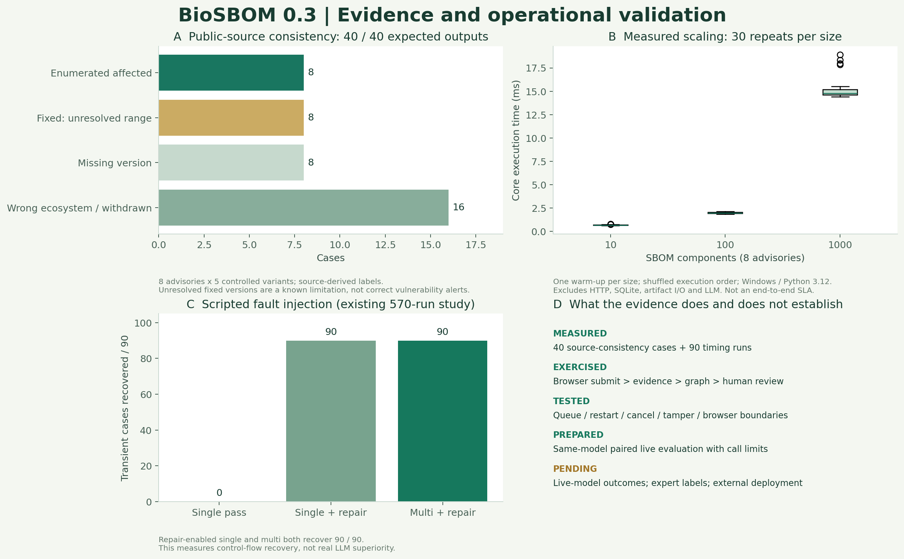

# 실험 근거와 재현 범위



## 1. 공개 advisory 계약 검사

`benchmarks/public-corpus/advisories.json`에는 requests, urllib3, jinja2, pillow, biopython, pyyaml, numpy, django의 공개 OSV 기록 8건이 있다. [provenance](../benchmarks/public-corpus/provenance.json)에 실제 조회 URL·시간·응답 SHA-256·선택 기준·보존 필드를 기록했다. OSV 원문 prose와 내부 배포 정보는 포함하지 않았다.

각 기록에서 명시 affected 버전, fixed 경계, 버전 누락, 다른 ecosystem, withdrawn 변형을 만든 40개 사례를 평가했다. 결과는 명시 일치 8, 불확실 범위 8, 버전 누락 8, 후보 없음 16이며 40개 모두 사전에 코드에 명시한 예상 처리와 일치했다.

이는 동일 원천에서 만든 fixture의 일관성 검사다. 독립 전문가 라벨·실제 환경 취약점 정확도·임상적 안전성 지표가 아니다. withdrawn와 ecosystem 변경은 통제 변형이며 실제 advisory가 철회되었다는 뜻이 아니다. **수정 버전 8개를 범위 해석 부재 때문에 불확실 후보로 남긴다.** 버전 범위 평가와 그에 따른 검토 부담 감소가 우선 보완 사항이다.

## 2. 크기별 실제 실행 시간

advisory 8건을 고정하고 컴포넌트 10·100·1,000개의 합성 SBOM을 만들었다. 크기별 1회 warm-up 후 각 30회를 고정 seed로 섞은 순서로 실행했다. 각 실행에서 finding 8개와 audit 통과를 확인했다.

| 컴포넌트 | 반복 | 중앙값 ms | p95 ms |
|---:|---:|---:|---:|
| 10 | 30 | 0.668 | 0.776 |
| 100 | 30 | 1.967 | 2.113 |
| 1,000 | 30 | 14.806 | 18.330 |

Windows / Python 3.12.14 / AMD64 한 환경의 perf_counter 측정이다. p95는 오름차순 표본의 ceil(0.95n)번째 값이다. HTTP·큐 대기·SQLite·보고서 저장·LLM은 제외했다. 네트워크 서비스 SLA나 다른 기계의 속도로 일반화하지 않는다.

- [40개 사례별 결과](experiments/public-corpus-v03/case-results.json)
- [90회 원시 시간 측정](experiments/public-corpus-v03/latency.csv)
- [환경·집계·제한](experiments/public-corpus-v03/summary.json)
- [고정 입력 사례](experiments/public-corpus-v03/cases.json)

```bash
python benchmarks/run_public_corpus.py --output runs/public-corpus --repeats 30
python -m pip install matplotlib
python docs/experiments/render_v03.py
```

그림 재생성은 문서에 저장된 원자료를 읽는다. 새 측정과 기존 측정을 혼합하지 않는다. 저장소 밖의 경로에서 실행해도 스크립트 위치를 기준으로 원자료를 찾는다.

## 3. 오류 주입 비교

기존 [570회 실험](experiments/fault-injection/RESULTS.md)은 scripted provider를 사용한다. transient 90개는 단일 pass 0개, 단일+repair 90개, multi+repair 90개가 복구되었다. 평균 호출 수는 각각 1·2·3회다. 결과를 multi-agent의 실제 LLM 우수성으로 해석하지 않는다. 독립 검증과 재검토 구조의 제어 흐름을 확인한 것이다.

## 4. 실제 모델 비교 도구

`benchmarks/run_live_models.py`는 동일 모델을 모든 역할에 사용하고, 입력별·반복별 single/multi를 고정 seed로 섞는다. 각 실행에 최대 6호출, 호출별 2,000 완료 토큰, 총 12,000 완료 토큰 예약, 단계별 2재검토를 부여한다. 입력 토큰·실제 요금의 상한은 아니다.

실험 전체의 최악 호출 수가 `--max-total-calls`를 넘으면 호출 전에 거부한다. `--confirm-live`도 필수다. 결과마다 원문·근거·판정·manifest를 저장하며 verified completion, 호출 수, 재검토 수, 공급자 보고 token, elapsed time을 기록한다. 모델 역할별 설정이 다르면 공정한 paired 비교가 아니므로 거부한다. provider URL·API key는 저장하지 않는다.

```bash
# BIOSBOM_MODEL / BIOSBOM_BASE_URL / 필요 시 BIOSBOM_API_KEY를 먼저 서버 환경에 설정
# cases.json은 공개/합성 Case 목록. 아래는 40사례 × 2구성 × 최대6호출의 상한 예시.
python benchmarks/run_live_models.py --cases docs/experiments/public-corpus-v03/cases.json --output runs/live-model --repeats 1 --max-total-calls 480 --confirm-live
```

현재 실제 모델 호출 결과는 없다. 도구의 예산·모델 일치 경계와 기록 동작은 mock transport로 테스트했다. 480호출 예시는 실행된 실험이나 권장 비용이 아니다. 작은 사전 지정 패널부터 점검하고 모델명·실제 사용량·표본 수·실패도 함께 보고해야 한다.

## 외부 명세

- [OSV schema](https://ossf.github.io/osv-schema/): affected versions와 range의 의미. 현재 구현은 ecosystem range 해석을 보류한다.
- [FastAPI lifespan](https://fastapi.tiangolo.com/advanced/events/): 서버 수명과 worker 소유권 연결.
- [Ollama OpenAI compatibility](https://docs.ollama.com/api/openai-compatibility): 선택적 로컬 모델 전송 방식. 실제 설치 모델별 호환성은 별도 확인한다.
