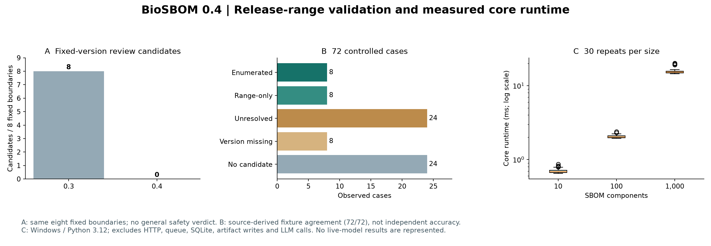
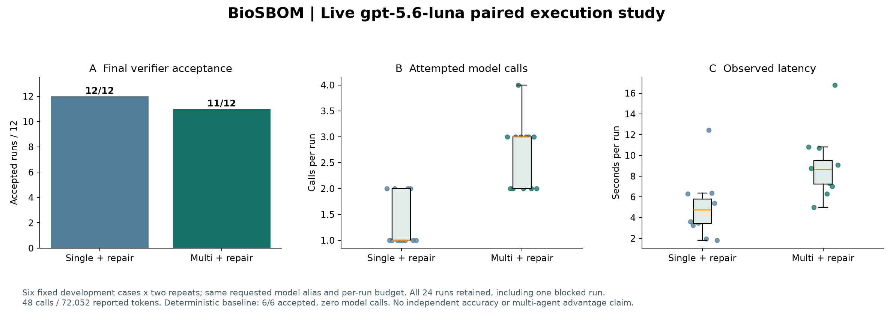

# 실험 근거와 재현 범위 — 0.4

## 공개 advisory와 버전 경계



공개 OSV 기록 8건에서 명시 affected 버전, fixed 경계, 버전 누락, 다른 ecosystem, withdrawn, range-only, 잘못된 버전, local build, GIT-only의 9개 통제 변형을 만들었다. **72/72가 예상 계약과 일치**했다. 명시 일치 8, 범위 일치 8, 후보 없음 24, 버전 누락 8, 모호한 후보 24다. 같은 fixed 경계 8건에서 0.3의 불확실 후보 8개가 0.4에서는 0개가 되었다.

이 결과는 출처 기반 fixture의 일관성 검사다. 독립 전문가 라벨, 실제 환경의 취약점 정확도, 공격 가능성 평가가 아니다. withdrawn·ecosystem 변경 등은 통제 변형이다. 미지원 ecosystem·GIT-only·잘못된 버전은 안전하다고 판정하지 않는다. [버전 해석 범위](VERSION_MATCHING.md)와 [출처·선정 기준](../benchmarks/public-corpus/provenance.json)을 함께 확인해야 한다.

## 크기별 실행 시간

advisory 8건을 고정하고 컴포넌트 10·100·1,000개의 합성 SBOM을 만들었다. 크기별 warm-up 1회 뒤 각 30회를 고정 순서 seed로 섞어 실행했다. 90회 모두 finding 8개와 audit 통과를 확인했다.

| 컴포넌트 | 반복 | 중앙값 ms | p95 ms |
|---:|---:|---:|---:|
| 10 | 30 | 0.688 | 0.823 |
| 100 | 30 | 2.030 | 2.308 |
| 1,000 | 30 | 15.197 | 19.784 |

Windows / Python 3.12.14 / AMD64 한 환경의 perf_counter 측정이다. p95는 정렬 표본의 ceil(0.95n)번째 값이다. HTTP·큐 대기·SQLite·보고서 저장·LLM은 제외했다. 서비스 SLA나 다른 기계의 속도로 일반화하지 않는다.

- [72개 결과](experiments/public-corpus-v04/case-results.json), [고정 입력](experiments/public-corpus-v04/cases.json)
- [90회 시간 원자료](experiments/public-corpus-v04/latency.csv), [환경·집계](experiments/public-corpus-v04/summary.json)
- [과거 0.3 자료](experiments/public-corpus-v03/summary.json)는 변경하지 않고 보존했다.

```bash
python benchmarks/run_public_corpus.py --output runs/public-corpus --repeats 30
python -m pip install matplotlib
python docs/experiments/render_v04.py
```

## 실제 모델 비교 — 2026-09-29



OpenAI Responses API의 요청 모델 `gpt-5.6-luna`를 모든 역할에 동일하게 사용했다. 합성 RNA-seq, 공개 snapshot, biopython range-only·version-missing·GIT-only, advisory가 없는 사례의 **6개 개발 패널 × 2회 × 2구성 = 24회**를 실행했다. 모든 배포 맥락은 합성이며 환자 정보나 내부 SBOM을 전송하지 않았다. 패널과 실행 순서는 본 실험 전에 고정했다. 별도의 공개 사전등록은 하지 않았다.

두 구성 모두 재검토를 허용한다. 단일 구성은 한 모델 응답에서 맥락과 위험 판정을 생성하고, 멀티 구성은 맥락과 위험 역할을 나눈다. 수집·검증·보고서는 결정론적 코드다. 실행당 최대 6호출, 단계별 최대 2재검토, 호출별 최대 2,000 output tokens, 총 12,000 output-token 예약을 적용했다. 동일 상한이 동일 실제 사용량을 뜻하지는 않는다. Responses의 strict JSON Schema와 store:false를 사용했으며 모델 seed·reasoning effort는 별도로 지정하지 않았다. 순서 shuffle seed는 42다.

| 구성 | 최종 검증 통과 | 실제 호출 | 평균 호출/실행 | 중앙 실행 시간 | 보고 total tokens | 재검토 이벤트 |
|---|---:|---:|---:|---:|---:|---:|
| 단일 + 재검토 | 12/12 | 16 | 1.33 | 4.723초 | 33,088 | 4 |
| 멀티 + 재검토 | 11/12 | 32 | 2.67 | 8.637초 | 38,964 | 9 |

총 **48호출, 공급자 보고 72,052 tokens**이며 모든 호출의 사용량이 알려져 있다. total tokens는 청구 금액이 아니며 output 예약은 입력 토큰·요금 상한이 아니다. 모델 별칭의 불변 backend revision은 기록하지 못했으므로 비트 단위 재현을 보장하지 않는다.

멀티 구성의 `biopython-range_only` 1회는 재검토 뒤에도 `context_evidence` 검증을 통과하지 못해 차단되었다. 해당 실패와 중간 오류를 제거하지 않았다. **이 패널에서는 멀티 구성의 우수성이 관찰되지 않았고 호출·시간은 증가했다.** 같은 6개 사례는 규칙 기반 비교군에서 모델 호출 없이 모두 검증을 통과했다. 따라서 이 결과는 현재 정책 과제에 LLM이 필요하다는 증거도 아니다.

최종 검증 통과는 근거 참조·정책 계약을 제한된 재검토 뒤 충족했다는 의미다. 첫 응답 정확도, 독립 과학 정답, 보안 진단 정확도를 측정하지 않았다. 6개 개발 사례와 2회 반복은 작고 독립 held-out 평가가 아니므로 유의성·일반화·모든 모델에 대한 결론을 제시하지 않는다. 다음 검증은 독립 전문가 라벨, 더 큰 사전 지정 패널, 여러 모델 및 정상 업무 효용을 포함해야 한다.

### 원자료와 재현

- [고정 패널](../benchmarks/live-panel-v04.json), [프로토콜·순서·입력 hash](experiments/live-v04/protocol.json)
- [24회 결과 CSV](experiments/live-v04/results.csv), [집계·한계](experiments/live-v04/summary.json)
- [모델 구조화 응답·사용량·요청 digest](experiments/live-v04/calls.json), [전체 실행 판정·이벤트](experiments/live-v04/run-records.json)
- [규칙 기반 비교군](experiments/live-v04/deterministic-baseline.json)
- [코드 SHA-256](experiments/live-v04/code-hashes.json): 실험 코드의 CRLF를 LF로 정규화한 UTF-8 바이트 기준. 실험 후 보존용으로 기록했으며 사전등록 증거가 아니다.

모델 연결 점검용 pilot 4회는 4/4 통과, 7호출, 16,225 tokens였다. [pilot 원자료](experiments/live-v04/pilot/results.json)는 본 패널과 합산하지 않았다. 웹앱의 별도 수동 실행도 본 연구 집계에서 제외한다. 공개본에는 구조화 응답과 안전한 오류 코드만 포함하며 API 키·header·개인 설정·원래 로컬 경로는 포함하지 않는다.

```bash
# BIOSBOM_MODEL / BIOSBOM_BASE_URL / BIOSBOM_API_KEY를 로컬 환경에 설정
# 이번 실험의 전송 형식: BIOSBOM_API_STYLE=responses
python benchmarks/run_live_models.py --cases benchmarks/live-panel-v04.json --output runs/live-model --repeats 2 --max-total-calls 144 --confirm-live
python docs/experiments/render_live_v04.py
```

144는 본 패널의 최악 호출 상한이며 실제 호출은 48이었다. 재실행에는 새 요금이 발생할 수 있다. 그림 스크립트는 문서에 보존한 원자료를 읽으며 새 측정과 자동 혼합하지 않는다.

## Scripted 오류 주입

기존 [570회 실험](experiments/fault-injection/RESULTS.md)은 scripted provider다. transient 90개는 단일 pass 0개, 단일+repair 90개, multi+repair 90개가 복구되었다. 평균 호출은 각각 1·2·3회다. 이는 독립 검증·재검토의 제어 흐름 검사이며 실제 LLM의 품질·비용 결과와 구분한다.

## 외부 명세

- [OSV schema](https://ossf.github.io/osv-schema/)
- [PEP 440 version parsing](https://packaging.pypa.io/en/stable/version.html), [SemVer](https://semver.org/)
- [OpenAI Structured Outputs](https://developers.openai.com/api/docs/guides/structured-outputs), [Responses migration](https://developers.openai.com/api/docs/guides/migrate-to-responses)
