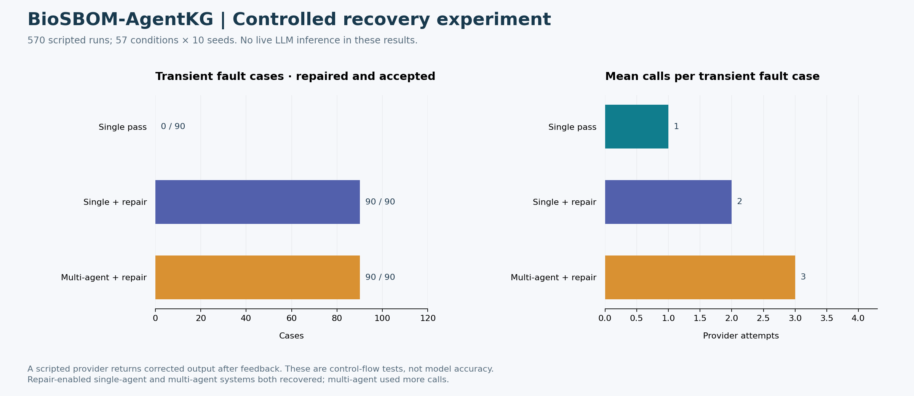

# 진행 상태와 다음 보완

| 영역 | 현재 확인된 상태 | 다음 보완 |
|---|---|---|
| 역할별 실행·재검토 | 구현 및 경계 조건 테스트 | 실제 모델별 실패 유형 수집 |
| 입력·근거·판정 검증 | 69개 테스트, 새 환경 설치 검증 | 더 큰 SBOM 및 ecosystem별 버전 범위 처리 |
| GitHub 자동 검증 | Ubuntu·Windows × Python 3.11·3.12의 4개 작업 통과 | 실제 모델·운영 환경 검증은 별도 |
| 오류 복구 비교 | scripted provider 570회 | 동일 모델·동일 예산의 실제 LLM 비교 |
| 공개 advisory 처리 | OSV 2건, package 6개 조건 | 독립 corpus 및 전문가 label |
| 사용성 | CLI와 HTML/Markdown 보고서 | 인증된 다사용자 검토 흐름 |
| 실행 안전성 | 예산·timeout·차단·무결성 검사 | 전자서명, reviewer 인증, 운영 접근 제어 |

현재 결과에서 transient 오류 90건은 재검토 가능한 단일 에이전트와 멀티에이전트 모두 복구했다. 평균 호출은 각각 2회와 3회였다. 이 결과를 멀티에이전트의 우수성으로 주장하지 않는다. 독립 검증과 재검토 루프가 동작함을 확인한 것이다.

실제 모델 성능, 원화·달러 비용, 위험 순위 정확도는 아직 측정하지 않았다. 다음 단계에서는 고정된 모델·프롬프트·입력·정답·예산을 준비해 평가해야 한다. 보안상 남은 경계는 [SECURITY.md](../SECURITY.md)에 별도로 기록했다.
