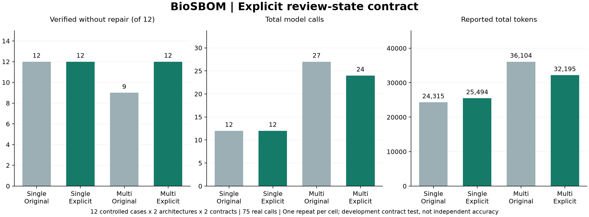

# Triage contract evaluation — 0.4.2

## Fixed protocol

The previous citation experiment retained one `review_required` correction. The new payload makes `review` a separate required state and lists allowed priorities/statuses for each finding. It does not change the independent verifier, thresholds, evidence, schema or add automatic output repair.

- [Twelve fully synthetic cases](../benchmarks/triage-panel-v042.json): missing CVSS with low/high context, KEV or EPSS; missing/unsupported versions; zero CVSS; CVSS 6.9/7 and exposure 6/7 boundaries; sensitive critical context.
- [Explicit expected contracts](../benchmarks/triage-expectations-v042.json) are written from the existing policy. These are controlled policy labels, not independent expert judgements. Tests check all four possible priorities against each expectation.
- Twelve cases × two architectures × two payloads × one repeat = **48 runs**, shuffled seed 1741. The original payload is verified against hashes from public commit `cd3c5e6756a72dce71956c25ff854a6ed716fe9b`.
- All roles use the same model. The sole ablation removes `triage_contract` for `v041_original`; context citation guidance is kept in both conditions.
- Six calls/run, two revisions/stage, 2,000 output tokens/call, 12,000 output-token reservation/run; worst-case ceiling 288 calls, not a fee cap.
- Primary outcome: no-repair verified completion, separately by architecture. Also retain final acceptance, review-required verifier events, calls, tokens, elapsed time and every failed attempt. No selective repeats or prompt tuning after this panel starts.

The policy intentionally requires manual review for missing CVSS even if another risk signal exists. This is the application's disclosed policy, not a universal vulnerability-management standard. No measured clinical, exploitability or independent accuracy claim is made. Targeted development cases and one repeat per cell cannot establish statistical significance or eliminate model variability. Rule-based execution remains a relevant zero-model-call baseline.

Engine events hash the pre-adapter payload. The per-call trace identifies the actual transmitted payload digest and the run/condition. No keys, headers or provider URLs are exported. Past panels remain separate.

```bash
python benchmarks/run_citation_ablation.py --comparison triage --cases benchmarks/triage-panel-v042.json --output runs/triage-ablation --max-total-calls 288 --confirm-live
```

## 실제 측정 결과 — 2026-09-29



`gpt-5.6-luna` 요청 별칭과 Responses 전송으로 48회를 완료했다. 총 **75호출·118,108 보고 tokens**, 전 호출 사용량 확인, 최종 검증 48/48 통과다. 수정 후에는 단일·멀티 모두 12/12가 재검토 없이 통과했다.

| 구성 | 계약 | 재검토 없이 통과 | 최종 통과 | review_required 이벤트 | 호출 | 보고 tokens | 중앙 시간 |
|---|---|---:|---:|---:|---:|---:|---:|
| 단일 | 기존 0.4.1 | 12/12 | 12/12 | 0 | 12 | 24,315 | 3.060초 |
| 단일 | 명시적 판정 계약 | 12/12 | 12/12 | 0 | 12 | 25,494 | 2.851초 |
| 멀티 | 기존 0.4.1 | 9/12 | 12/12 | 3 | 27 | 36,104 | 5.319초 |
| 멀티 | 명시적 판정 계약 | 12/12 | 12/12 | 0 | 24 | 32,195 | 5.551초 |

기존 멀티 구성의 오류는 `missing-version`, `missing-cvss-kev`, `unsupported-range`였다. 각 1회 재검토 후 통과했다. 새 계약에서는 같은 사례의 오류가 관찰되지 않았다. 검증 기준이나 판정을 자동 보정해서 통과시킨 결과가 아니다.

**모든 측정이 개선된 것은 아니다.** 단일 구성은 기존에도 오류가 없었으며 토큰이 24,315→25,494로 늘었다. 멀티 구성의 호출은 27→24로 줄었지만 중앙 시간은 5.319→5.551초로 늘었다. 단일 반복·시간 변동·모델 별칭의 한계가 있어 일반적인 속도 향상이나 유의한 차이라고 해석하지 않는다. 두 구성을 합친 호출은 39→36, 보고 tokens는 60,419→57,689였다.

규칙 기반 비교군은 12개 모두 모델 호출 없이 통과했다. 이 패널에서의 100% 계약 통과는 독립 보안 정확도나 LLM 필요성, 멀티 구성의 우위가 아니다. 과거 24회·32회 패널과 합쳐 정확도를 계산하지 않는다.

### 보존·재현 자료

- [프로토콜](experiments/triage-v042/protocol.json), [48회 CSV](experiments/triage-v042/results.csv), [집계](experiments/triage-v042/summary.json)
- [사례별 전후 비교](experiments/triage-v042/paired-results.json), [75회 호출 원자료](experiments/triage-v042/calls.json), [전체 판정·이벤트](experiments/triage-v042/run-records.json)
- [규칙 기반 비교군](experiments/triage-v042/deterministic-baseline.json), [코드 해시](experiments/triage-v042/code-hashes.json)
- 실험 전 로컬 고정 [소스 커밋](https://github.com/CHOMINWOO1/BioSBOM-AgentKG/tree/b2cb45ee5871c437188db9d66ce118d9b8c4d2f6). 공개 사전등록이 아니며 코드 해시는 CRLF→LF 정규화 SHA-256이다.

48개 원래 실행 폴더의 manifest를 검증했고, 집계 스크립트가 실행별 trace 수·사용량·audit·condition pairing을 다시 확인한다. 요청 모델 별칭은 기록했지만 불변 backend revision은 기록하지 못했다.

```bash
python docs/experiments/summarize_triage_v042.py
python docs/experiments/render_triage_v042.py
```

다음 연구 과제는 다른 모델과 독립 라벨 자료에서의 검증이다. 이 개발 패널을 반복 조정해 통과율을 높이는 방식으로 대체하지 않는다.
