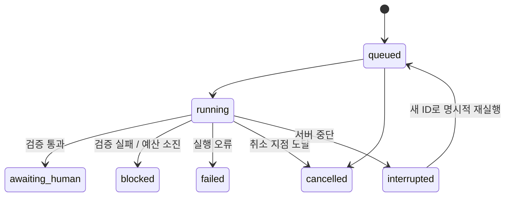
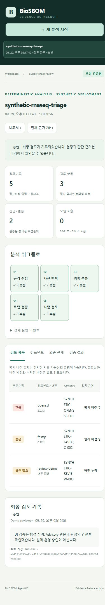

# 로컬 웹 작업 공간

```bash
python -m pip install -e ".[web,dev]"
biosbom-agentkg serve --port 8876 --data-dir runs/workbench
```

브라우저에서 `http://127.0.0.1:8876`을 연다. 기본 서버는 loopback에만 바인딩한다. 서버가 실행 중이면 브라우저를 닫아도 큐는 계속 처리된다. 서버 종료는 Ctrl+C이며 진행 중인 HTTP 호출은 응답 또는 timeout 뒤 취소 지점을 통과한다.

## 분석에서 검토까지

1. **새 분석 시작**에서 합성 RNA-seq 사례, 공개 OSV 사례 또는 Case JSON 파일을 선택한다. Case는 `sbom`, `advisories`, `context`를 포함한다. 원시 SBOM만 올리는 형식은 아직 지원하지 않으며 화면에서 내려받은 예제에 advisory snapshot과 자산 맥락을 함께 넣는다.
2. 규칙 기반 모드는 외부 통신이 없다. LLM 모드는 서버 환경변수를 사용하며, 화면에서 데이터 전송·호출 비용을 확인해야 시작된다. `설정됨`은 연결 테스트 성공이라는 뜻이 아니다.
3. 실행 이력에서 상태와 역할별 이벤트를 확인한다. 검토 항목에서 **근거**를 누르면 advisory·SBOM·맥락·sidecar 원문과 SHA-256을 볼 수 있다.
4. 컴포넌트 표, 의존 관계 그림, 검증 결과를 확인한다. 그래프는 40개 노드까지 표시하며 전체 그래프는 내보내기 ZIP에 포함된다.
5. **최종 검토**에서 승인·보류·반려와 이유를 기록한다. 승인 기록은 실제 패치나 배포를 실행하지 않는다. 저장 후 같은 실행의 검토는 덮어쓰지 않는다.
6. HTML 보고서 또는 입력·근거·이벤트·결과·manifest·검토 기록을 포함한 ZIP을 내려받는다. 사용자가 민감한 입력을 넣었다면 내보낸 ZIP에도 포함된다.

## 실행 상태와 복구



동일 요청 키·동일 입력의 재전송은 기존 실행을 반환한다. 같은 키로 다른 입력을 보내면 거부한다. 큐는 최대 20개 활성 실행을 허용하고 단일 worker가 순서대로 처리한다. OS 파일 잠금으로 데이터 폴더의 worker 중복 소유를 거부한다.

재시작 시 미완료 running 상태를 자동 유료 재실행하지 않는다. 이미 온전한 결과 파일이 게시되어 있으면 무결성을 검증해 완료 상태를 복구하고, 그 외에는 interrupted로 남긴다. queued 실행은 처리한다. cancelled / interrupted / failed / blocked 실행의 재시도는 새 ID와 원 실행 연결을 갖는다. 서버를 재시작하면 브라우저를 새로고침하여 새 로컬 세션을 만든다.

## 한계와 운영 설정

- 단일 사용자·단일 로컬 프로세스용이다. 다중 사용자 인증, RBAC, 외부 인터넷 서비스 배포, HA는 포함하지 않는다.
- HTTP 입력은 2 MB, 컴포넌트는 2,000개, 컴포넌트 수 × advisory 수는 20,000 이하로 제한한다. 큰 데이터는 먼저 분할하거나 CLI를 사용한다.
- 로컬 세션 쿠키·CSRF 토큰·Host/Origin 검사는 브라우저의 교차 출처 요청을 제한한다. 같은 OS 사용자의 악성 프로세스를 막는 인증 수단이 아니다.
- API 키와 endpoint URL은 화면·결과에 반환하지 않는다. `.env.example`은 문서이며 자동 로드하지 않는다.
- 서버를 처음 실행한 OS 계정과 같은 계정으로 재시작하고 데이터 폴더 권한을 유지한다. 접근 오류가 나면 원본을 덮어쓰거나 권한 보호를 해제하지 말고 계정·폴더 접근권한을 점검한다.
- 실행 취소는 협력적이다. 이미 전송된 요청의 공급자 측 계산·과금을 되돌릴 수 없다.
- 설치된 wheel에도 UI와 두 예제가 포함되어 저장소 밖에서 실행할 수 있다.


